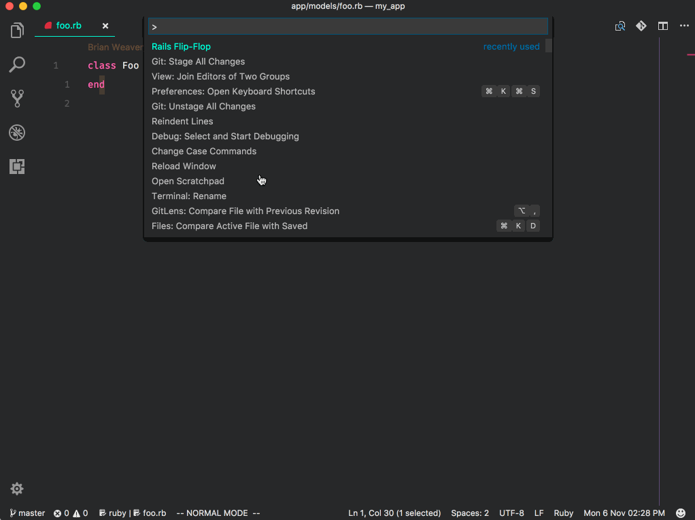

# Rails Flip-Flop

[View on Github](https://github.com/bweave/rails-flip-flop)

Flip-flop from code to the related test, and vice-versa in [Visual Studio Code](https://code.visualstudio.com/)

## WIP

This extension is a WIP. And like most OSS, I get to work on it here and there, but not often. PR contributions are definitely welcome!

**TODO**

- [x] Open files in split
- [ ] _Optionally_ open files in split
- [ ] Write tests

## Usage

Open the command pallet and start typing "flip-flop". With "Rails Flip-Flop" highlighted, hit return and flip over to the related file for the currently open file. If the file doesn't exist, you'll be prompted with the option to create it.

> It's recommended to setup a keyboard shortcut to access this command quickly.
## Known Issues

None, so far! By all means tho, lemme know if you find an issue!

## Release Notes

### 0.0.3

- Add some tests
- Open files in a split

### 0.0.2

- Fix those links to Github

### 0.0.1

Initial release

----

Inspired by [tpope/vim-rails](https://github.com/tpope/vim-rails) & [rails-go-to-spec-vscode](https://github.com/sporto/rails-go-to-spec-vscode).
